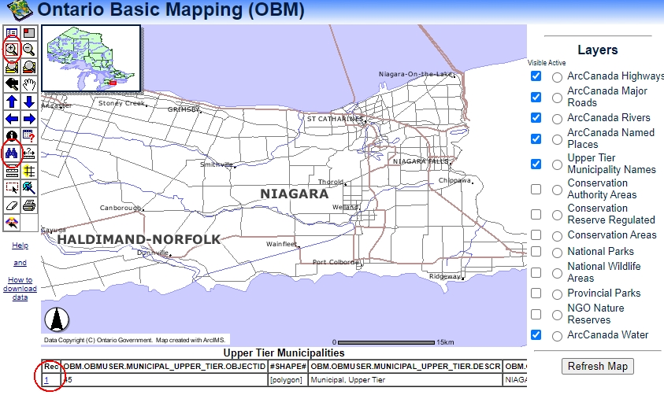

![Tool Logo][imglogo]

# Ontario Basic Mapping Data
Ontario Base Maps are a popular collection that provides large scale coverage of the province (1:10,000 - 1:20,000 in the North). The Ontario Basic Mapping Data represents the various geospatial layers that make up these topographic maps. Although the referenced web app and data is somewhat dated, it will prove useful for historical context or basic mapping at a large scale.  

### Access the Data
1. Go to [http://www.geographynetwork.ca/website/obm/viewer.htm](http://www.geographynetwork.ca/website/obm/viewer.htm)
2. To zoom to your area of interest click the binoculars to search for an upper tier municipality, such as "Niagara". 
3. Click Find String.  
4. From the results displayed at the bottom of the window, click the tiny blue link to the left of the result. The map will zoom to the extent of the upper tier municipality. See above screenshot.

    
   
6. Zoom in even more by clicking the plus magnifying glass and drawing a box on the map.
7. 

### Second Header

Content

### Etc.
 
 
 

  
**This tutorial is brought to you by the Brock University Digital Scholarship Lab.  For more information on the DSL check out our website at [www.brocku.ca/library/dsl/](https://brocku.ca/library/dsl/) or you can e-mail us at dsl@brocku.ca.**  
  
You can also find us on:  
[Facebook](https://www.facebook.com/Brock-University-Digital-Scholarship-Lab-349407235866792/)  
[Twitter](https://twitter.com/brock_dsl)  
[Instagram](https://www.instagram.com/brock_dsl/?hl=en)  
[YouTube](https://www.youtube.com/channel/UC2eEqPkDo-1N3qilxv-N_1g/featured?view_as=subscriber)

<!--- Please use reference style images so that it is easier to update pictures later --->

[imglogo]: INSERT LOGO FILENAME HERE
